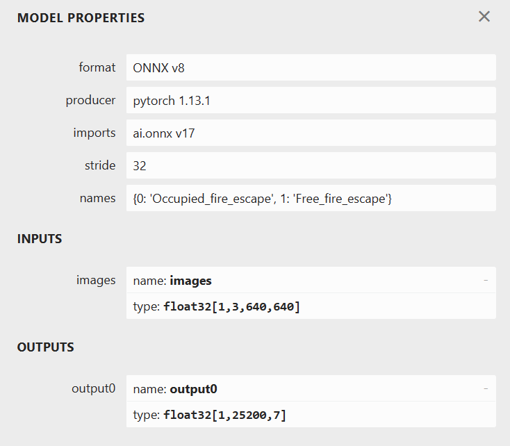

# Onnx-server
 使用yolo分类和检测转化的onnx模型，实现消防通道占用检测的服务部署

## 项目功能
 搭建onnx检测平台，并使用onnx格式模型文件检测目标，可本地使用，也可作为服务的方式，通过API向外部提供服务。
## Onnx介绍
 ONNX 是一种用于表示机器学习的开放格式 模型。ONNX 定义了一组通用运算符（机器学习和深度学习模型的构建基块）和通用文件格式，使 AI 开发人员能够使用具有各种框架、工具、运行时和编译器的模型。  
官网地址：https://onnx.ai/  
可视化onnx模型网络结构：https://netron.app/

## 安装方式


## 服务部署
```
uvicorn main:app --reload --host 0.0.0.0
```

## 模型介绍
### 1.检测模型


## bug日志
### 2023-6-7: ONNX Runtime（ORT）模型推理报错
```C++{.line-numbers}
ValueError: This ORT build has ['TensorrtExecutionProvider',   
'CUDAExecutionProvider', 'CPUExecutionProvider'] enabled. Since ORT 1.9,   
you are required to explicitly set the providers parameter when   
instantiating InferenceSession. For example, onnxruntime.
InferenceSession(..., providers=['TensorrtExecutionProvider',   
'CUDAExecutionProvider', 'CPUExecutionProvider'], ...) 
```
> 这句报错提示了一个 `ValueError`，它的意思是在使用 ONNX Runtime（ORT）模型推理时出现了问题报错中指出，在 ORT 的版本 1.9 及以后，必须显式设置 `providers` 参数来实例化 `InferenceSession` 对象。providers 参数是一个列表，其中包含用于执行推理的提供程序名称。
具体地说，此错误发生是因为在ORt1.9及之后的版本中，默认情况下所有的`execution provider`都被启用了，没有在创建`InferenceSession`对象时明确指定要使用的`execution provider`。
要解决此问题，您需要在创建 `InferenceSession` 对象时显式设置 `providers` 参数，例如：`onnxruntime.InferenceSession(..., providers=['TensorrtExecutionProvider', 'CUDAExecutionProvider', 'CPUExecutionProvider'], ...)`，将其中的`provider`名称替换为需要使用的执行提供程序名称即可。

本地onnx推理模型cuda调用一直失败，换回onnx的cpu版本则正常运行（GPU硬件加速**待解决**）
```C++{.line-numbers}
2023-06-07 23:57:31.4782950 [E:onnxruntime:Default, provider_bridge_ort.cc:1351 onnxruntime::TryGetProviderInfo_CUDA]   
D:\a\_work\1\s\onnxruntime\core\session\provider_bridge_ort.cc:1131   
onnxruntime::ProviderLibrary::Get [ONNXRuntimeError] : 1 : FAIL :   
LoadLibrary failed with error 126 "" when trying to load   
"C:\Users\Code'Z\.conda\envs\YOLOv5\lib\site-packages\onnxruntime\capi\onnxruntime_providers_cuda.dll"
```